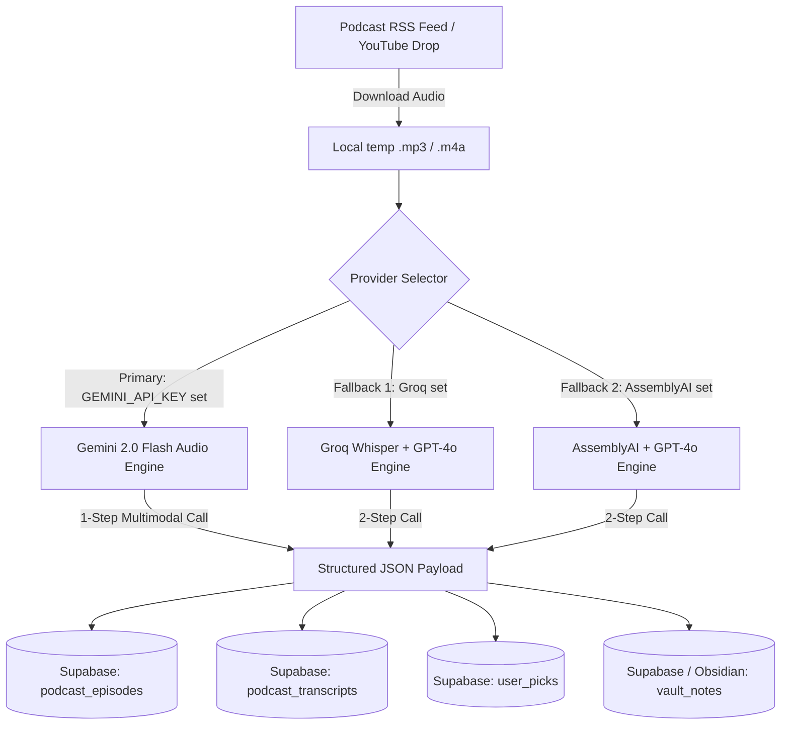

# Gemini 2.0 Multimodal Audio Migration Specification

> **Document Version:** 1.1  
> **Status:** Draft / Ready for Engineering Review  
> **Author:** Antigravity AI  
> **Target Files**: `agents/podcast-ingest.js`, `agents/lib/gemini-audio-transcribe.js`, `.github/workflows/podcast-ingest.yml`

---

## 1. Architectural Summary & Migration Rationale

The current Platinum Rose podcast ingestion pipeline ([agents/podcast-ingest.js](file:///e:/dev/projects/NFL_Dashboard/agents/podcast-ingest.js)) relies on a multi-stage process:
1. **Step 1 (Audio Transcription)**: Groq Whisper (`whisper-large-v3`) with fallbacks to AssemblyAI or OpenAI Whisper.
2. **Step 2 (Pick & Intel Extraction)**: GPT-4o text prompt over the generated transcript.

### Current Limitations:
* **Audio Size Limits**: Capped at 24 MB (25 MB Whisper limit), requiring truncation or compression for episodes over 35 minutes.
* **Rate Limits**: Groq's 7,200 sec/hr limit causes `RateLimitError` halts during heavy podcast drop days (e.g. Wednesday/Friday slates).
* **Multi-Step Latency & Cost**: Double API calls (Whisper STT + GPT-4o LLM) add execution latency (~45s per run) and higher cost (~$0.02 - $0.19 per episode).

### Gemini 2.0 Multimodal Audio Solution:
* **Single 1-Step Pass**: Upload audio `.mp3`/`.m4a` directly to Gemini File API; Gemini 2.0 Flash performs audio listening, speaker diarization, and pick extraction in a single API call.
* **Massive Capacity**: Handles up to **9.1 hours of continuous audio** (1M+ context window) and files up to **2 GB**.
* **Ultra Low Cost**: **~$0.006 per 30-min episode** / **~$0.012 per 1-hour episode** ($0.10 / 1M audio input tokens).
* **Data Parity**: Produces exact structural parity for `podcast_episodes`, `podcast_transcripts`, `user_picks`, and `vault_notes`.

---

## 2. Comprehensive Cost & Financial Comparison

Below is the detailed pricing breakdown comparing Gemini 2.0 Multimodal Audio against the current Groq, AssemblyAI, and OpenAI Whisper pipelines.

### 2.1 Pricing Rate Specifications

* **Gemini 2.0 Flash Audio Token Conversion**: $1 \text{ second of audio} = 32 \text{ input tokens}$
* **Gemini 2.0 Flash Input Rate**: **$0.10 per 1,000,000 tokens**
* **Gemini 2.0 Flash Output Rate**: **$0.40 per 1,000,000 tokens**
* **OpenAI Whisper API Rate**: **$0.006 per minute**
* **AssemblyAI Rate**: **~$0.37 per hour** ($0.0061/min)
* **GPT-4o Input / Output Rate**: $2.50 / 1M input tokens | $10.00 / 1M output tokens

### 2.2 Side-by-Side Cost Comparison Table

| Pipeline Architecture | 30-Min Episode | 1-Hour Episode | 2-Hour Episode | Season Cost (200 Episodes) |
|---|---|---|---|---|
| **Gemini 2.0 Flash Direct Audio** (Option A) | **$0.006** | **$0.012** | **$0.024** | **$1.80 – $2.40** |
| **Groq Whisper + GPT-4o-mini** | $0.015 | $0.030 | $0.060 | $4.50 – $6.00 |
| **AssemblyAI + GPT-4o** | $0.085 | $0.170 | $0.340 | $25.50 – $34.00 |
| **OpenAI Whisper + GPT-4o** | $0.190 | $0.380 | $0.760 | $57.00 – $76.00 |

> **Financial Impact**: Switching to Gemini 2.0 Flash reduces podcast ingestion costs by **60% compared to Groq+GPT-4o-mini**, **93% compared to AssemblyAI**, and **97% compared to OpenAI Whisper**.

---

## 3. Target System Architecture



---

## 4. Provider Order & Fallback Strategy

The migration introduces `agents/lib/gemini-audio-transcribe.js` as the **Primary Provider**:

```javascript
// Provider Priority Order
const PROVIDER_ORDER = [
  'gemini-2.0-flash',  // Priority 1: 1-step multimodal audio (Fastest, cheapest, 1M context)
  'groq-whisper',       // Priority 2: Free Whisper (7200 sec/hr limit)
  'assemblyai',         // Priority 3: Paid AssemblyAI (No file size limit)
  'openai-whisper'      // Priority 4: Standard OpenAI Whisper
];
```

---

## 5. Unified Output Data Contract Schema

To ensure 100% backward compatibility with the existing React UI (`Podcasts` tab) and database queries (`src/lib/supabase.js`), the Gemini engine returns data strictly matching the established schema.

### 5.1 `podcast_transcripts` Table Contract
```typescript
interface PodcastTranscriptRecord {
  episode_id: string;              // UUID referencing podcast_episodes
  transcript_text: string;          // Full text formatted transcript
  speaker_segments: Array<{         // Diarized speaker segments
    start: number;                 // Seconds (e.g. 154.64)
    end: number;                   // Seconds (e.g. 208.18)
    speaker: string;               // "Chad Millman" | "Simon Hunter" | "Host"
    text: string;
  }>;
  extraction_model: string;         // "gemini-2.0-flash"
  extraction_quality_score: number; // 0 - 100 confidence score
  created_at: string;               // ISO Timestamp
}
```

### 5.2 Extracted Pick Record (`user_picks` Table Contract)
```typescript
interface ExtractedPickRecord {
  game_id?: number;
  season: number;                  // 2026
  week: number;                    // 0 - 18
  expert: string;                  // e.g. "Simon Hunter"
  team: string;                    // Canonical abbreviation (e.g. "BUF")
  bet_type: "spread" | "total" | "moneyline" | "futures" | "win_total";
  selection: string;               // "OVER" | "UNDER" | "BUF"
  line: number;                    // e.g. 10.5
  price: number;                   // e.g. -115
  units: number;                   // 1.0
  rationale: string;               // Verbatim quote and reasoning
  source: "EXPERT";
  source_episode_id: string;
}
```

---

## 6. Implementation Code Spec (`agents/lib/gemini-audio-transcribe.js`)

```javascript
import { genai } from '@google/genai';
import { readFileSync, unlinkSync } from 'node:fs';

/**
 * Transcribe and extract betting picks in a single pass using Gemini 2.0 Flash.
 *
 * @param {string} audioFilePath - Local path to .mp3 or .m4a file
 * @param {Object} episodeMeta   - { title, show, pubDate }
 * @returns {Promise<{ transcriptText, speakerSegments, extractedPicks, vaultMarkdown }>}
 */
export async function transcribeAndExtractWithGemini(audioFilePath, episodeMeta) {
  const apiKey = process.env.GEMINI_API_KEY;
  if (!apiKey) throw new Error('GEMINI_API_KEY not configured');

  const client = new genai.Client({ apiKey });

  // 1. Upload audio file to Gemini File API
  const fileUpload = await client.files.upload({ file: audioFilePath });

  // 2. Multimodal Extraction Prompt
  const prompt = `
You are the Platinum Rose Podcast Ingestion Engine.
Analyze the attached audio file from show: "${episodeMeta.show}", episode: "${episodeMeta.title}".

Task:
1. Provide a verbatim diarized transcript with timestamps and speaker names.
2. Extract all explicit betting picks, win totals, futures, and leans.

Return a JSON object with this exact structure:
{
  "transcriptText": "Full formatted transcript string...",
  "speakerSegments": [
    { "start": 0.0, "end": 12.5, "speaker": "Chad Millman", "text": "..." }
  ],
  "extractedPicks": [
    {
      "expert": "Simon Hunter",
      "team": "BUF",
      "betType": "win_total",
      "selection": "OVER",
      "line": 10.5,
      "price": -115,
      "rationale": "Graded over 11.5; 4 easy division wins vs Jets/Dolphins."
    }
  ],
  "vaultMarkdown": "Full formatted Obsidian Markdown note..."
}
`;

  try {
    const response = await client.models.generateContent({
      model: 'gemini-2.0-flash',
      contents: [fileUpload, prompt],
      config: { responseMimeType: 'application/json' }
    });

    // Clean up temporary remote file
    await client.files.delete({ name: fileUpload.name });

    return JSON.parse(response.text);
  } catch (err) {
    // Ensure remote file cleanup on error
    try { await client.files.delete({ name: fileUpload.name }); } catch (_) {}
    throw err;
  }
}
```

---

## 7. Migration Rollout Steps

1. **Step 1: Deploy `agents/lib/gemini-audio-transcribe.js`**
   Add helper module with standard JSON contract output.
2. **Step 2: Update `agents/podcast-ingest.js`**
   Add `GEMINI_API_KEY` check at top of provider selector. If present, execute 1-step Gemini pass. If absent or failed, fall back to Groq/AssemblyAI.
3. **Step 3: Update `.github/workflows/podcast-ingest.yml`**
   Add `GEMINI_API_KEY: ${{ secrets.GEMINI_API_KEY }}` to secret step.
4. **Step 4: Verification Run**
   Execute `node agents/podcast-ingest.js --dry-run` to confirm 100% schema conformance.
