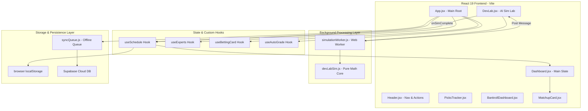
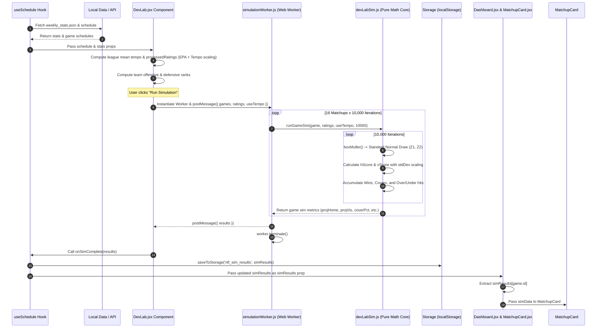

# Platinum Rose NFL Dashboard — System Architecture & Data Flow

## 1. System Architecture Overview

The **Platinum Rose NFL Dashboard** is a high-performance sports analytics and betting intelligence application. It is constructed using a modern, decoupled web architecture built on **React 19**, **Vite**, **Tailwind CSS v3**, **Supabase**, and **Web Workers**.



---

## 2. Component Structure & Tailwind CSS Integration

### 2.1 Styling Architecture Principles
The application implements a **Vanilla CSS core + Tailwind CSS utility engine** designed for ultra-high visual impact, high-density dashboard layouts, and dynamic data-driven feedback.

* **Configuration Basis** (`tailwind.config.js` & `src/index.css`):
  * PostCSS processes `@tailwind base; @tailwind components; @tailwind utilities;`.
  * Dark Mode is enforced globally at the root body level (`bg-[#0f0f0f] text-white`).
* **Design Token Palette**:
  * **Background Surfaces**: `#0f0f0f` (Main background), `bg-slate-900` (Cards), `bg-slate-950/50` (Scoreboards & Deep containers), `bg-slate-800/50` (Badges).
  * **Accent Color Tokens**:
    * `#00d2be` / `emerald-400`: Positive value edges, covers, AI confidence, win probabilities.
    * `cyan-500` / `purple-400`: AI Dev Lab branding, teaser calculations, total plays.
    * `rose-400` / `rose-900`: Negative value edges, warnings, missing data flags.
    * `amber-400`: Star ratings and value indicators.

### 2.2 Component Interaction with Tailwind Styling

React components interact with Tailwind styling through three primary patterns:

#### A. Direct Utility Composition & Layout Structure
Components construct UI hierarchies using layout utilities directly within `className` strings:
```jsx
// DevLab.jsx Header Container
<div className="bg-slate-900 border border-slate-800 rounded-xl p-6 flex flex-col md:flex-row justify-between items-center shadow-lg gap-4">
```

#### B. Dynamic & Conditional Class Binding
Tailwind classes are conditionally applied based on component state, data properties, or calculated edge metrics:
```jsx
// Dynamic Confidence Level Text Color (DevLab.jsx)
<span className={`font-bold ${
  confidence === 'High' ? 'text-emerald-400' : 
  confidence === 'Med' ? 'text-emerald-200' : 'text-slate-500'
}`}>
  {confidence === 'None' ? 'No Edge' : `${confidence} (${edgePct.toFixed(0)}%)`}
</span>

// Selected Bet State Glow & Border (MatchupCard.jsx)
const styleClass = isBetActive 
  ? 'bg-emerald-900/20 text-emerald-300 shadow-[0_0_15px_rgba(52,211,153,0.4)] border-emerald-400 scale-[1.02] ring-1 ring-emerald-400' 
  : 'bg-slate-800 hover:bg-slate-700 border-slate-700/50 text-slate-500';
```

#### C. Micro-Animations & Interactivity
Tailwind utilities handle dynamic UI state changes such as smooth tab transitions, spinner animations, and hover elevation:
* **Keyframes & Animation Utilities**: `animate-spin` (loading states), `animate-in fade-in zoom-in duration-300` (tab mounting).
* **Interactive Modals & Dropdowns**: Fixed positioning with `z-[9999]`, backdrop blur, and smooth scaling.

---

## 3. Monte Carlo Simulation Engine: Data Flow Trace

The Monte Carlo simulation engine models game outcomes by performing **10,000 statistical iterations per matchup** using offensive/defensive Efficiency Ratings (EPA) and pace/tempo scalars.

### 3.1 End-to-End Monte Carlo Data Flow Sequence



---

### 3.2 Step-by-Step Data Flow Breakdown

#### Step 1: Ingestion & Boot Initialization (`useSchedule.js`)
* On application mount, `useSchedule` fetches schedule games and team statistical profiles from `LOCAL_DATA.WEEKLY_STATS` (`weekly_stats.json`).
* `simResults` state is initialized from `localStorage` using `PR_STORAGE_KEYS.SIM_RESULTS.key` (`nfl_sim_results`).

#### Step 2: Rating Normalization & Ranking (`DevLab.jsx`)
* When `stats` update, `DevLab.jsx` processes team offensive (`off_epa`) and defensive (`def_epa`) metrics into normalized ratings.
* **Tempo Multiplier**: Calculates the league average pace (`meanTempo`) and clips each team's pace multiplier between `0.85` and `1.15`:
  $$\text{tempoMult} = \max\left(0.85, \min\left(1.15, \frac{\text{rawTempo}}{\text{meanTempo}}\right)\right)$$
* **League Rankings**: Sorts teams by offensive EPA (higher is better) and defensive EPA (lower is better) to assign relative league ranks (`ranks`).

#### Step 3: Off-Main-Thread Dispatching (`simulationWorker.js`)
* Triggered by user action (`handleRunSims`), `DevLab.jsx` instantiates a dedicated Web Worker using Vite's ES module worker syntax:
  ```javascript
  const worker = new Worker(
      new URL('../../workers/simulationWorker.js', import.meta.url),
      { type: 'module' }
  );
  ```
* UI sets `isRunning = true` and posts payload `{ games, ratings, useTempo }` to the worker thread, avoiding main thread blocking or UI freezing.

#### Step 4: Mathematical Simulation Loop (`devLabSim.js`)
For each game in the schedule, `runGameSim()` executes 10,000 iterations:
1. **Base Score Projections**:
   $$\text{baseHome} = (\text{off}_{\text{home}} \cdot 35) + (\text{def}_{\text{visitor}} \cdot 35)$$
   $$\text{baseVis} = (\text{off}_{\text{visitor}} \cdot 35) + (\text{def}_{\text{home}} \cdot 35)$$
   $$\text{projHome} = 21.5 + (\text{baseHome} \cdot \text{tempo}_{\text{home}}) + 1.5 \quad \text{(1.5 = Home Field Advantage)}$$
   $$\text{projVis} = 21.5 + (\text{baseVis} \cdot \text{tempo}_{\text{visitor}})$$

2. **Box-Muller Random Normal Sampling**:
   Independent standard-normal distribution random variables $Z_1, Z_2 \sim \mathcal{N}(0,1)$ are drawn using the Box-Muller transform:
   ```javascript
   function boxMuller() {
       let u, v;
       do { u = Math.random(); } while (u === 0);
       do { v = Math.random(); } while (v === 0);
       return Math.sqrt(-2.0 * Math.log(u)) * Math.cos(2.0 * Math.PI * v);
   }
   ```

3. **Iterative Game Scoring**:
   $$\text{hScore} = \text{projHome} + (Z_1 \cdot \text{adjStdDev})$$
   $$\text{vScore} = \text{projVis} + (Z_2 \cdot \text{adjStdDev})$$
   * Accommodates win/loss count, spread cover count ($(\text{hScore} - \text{vScore}) > -\text{spread}$), and total points over/under count ($(\text{hScore} + \text{vScore}) > \text{total}$).

#### Step 5: Worker Response & State Callback
* `simulationWorker.js` packages all computed probabilities into a map keyed by `game.id`.
* Worker emits `self.postMessage({ results })` and terminates.
* `DevLab.jsx` receives `results`, sets its local `simResults` state, and invokes `onSimComplete(results)`, triggering state update in `useSchedule`.

#### Step 6: Storage Persistence & Downstream UI Rendering
* **Auto-Persistence**: `useSchedule` triggers a side-effect saving `simResults` into `localStorage`.
* **DevLab Rendering (`SimCard`)**: Computes AI Value Rating stars, confidence levels (`High`, `Med`, `Low`, `Lean`), and recommended spread/total plays.
* **Dashboard Rendering (`MatchupCard`)**: `App.jsx` passes `simResults` down to `Dashboard.jsx`. Each `MatchupCard` receives its corresponding `simData`, displaying expected scores, projected win probabilities, and value edges alongside sportsbook lines.

---

## 4. Simulation Data Contract Specifications

### Input Game Object Schema
```typescript
interface Game {
  id: number;
  home: string;        // e.g. "KC" or "Kansas City Chiefs"
  visitor: string;     // e.g. "BAL" or "Baltimore Ravens"
  spread: number;      // e.g. -3.5 (negative indicates home favorite)
  total: number;       // e.g. 47.5
}
```

### Input Team Rating Object Schema
```typescript
interface TeamRating {
  off: number;         // Offensive EPA
  def: number;         // Defensive EPA
  offPass?: number;    // Passing EPA
  offRush?: number;    // Rushing EPA
  defPass?: number;    // Defensive Pass EPA
  defRush?: number;    // Defensive Rush EPA
  tempo: number;       // Normalized pace multiplier (0.85 - 1.15)
}
```

### Output Simulation Result Schema
```typescript
interface SimResult {
  hasData: boolean;
  homeWinPct: string;   // e.g. "64.2"
  homeCoverPct: string; // e.g. "57.5"
  visCoverPct: string;  // e.g. "42.5"
  overPct: string;      // e.g. "53.1"
  underPct: string;     // e.g. "46.9"
  projHome: number;     // Projected home score (e.g. 24.8)
  projVis: number;      // Projected visitor score (e.g. 20.3)
  projTotal: number;    // Total score projection (e.g. 45.1)
}
```
