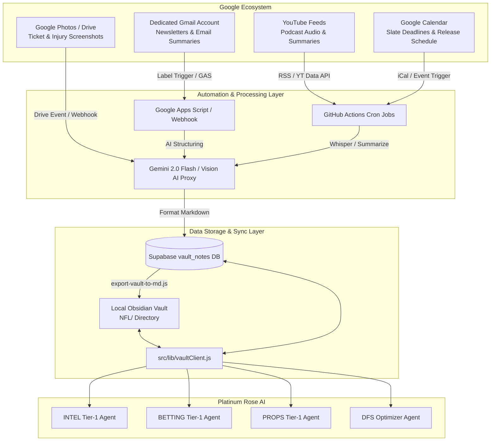
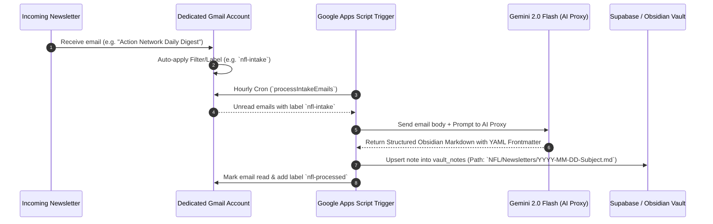
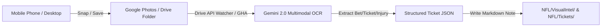
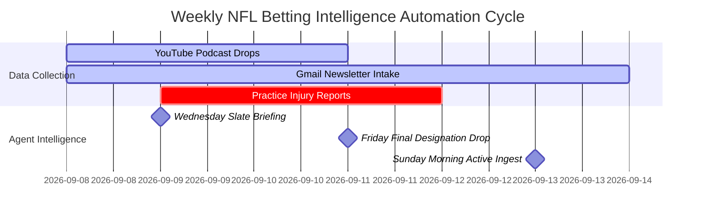

# Google Ecosystem Intake & Obsidian Vault Integration Blueprint

## 1. Executive Summary

This document details an automated architecture for connecting a dedicated **Intake Gmail Account**, **Google Calendar**, **Google Photos / Drive**, and **YouTube Podcast Feeds** directly into your **Platinum Rose Obsidian Vault** (and Supabase `vault_notes` database). 

By leveraging **Google Apps Script (GAS)**, **Gemini 2.0 Multimodal AI**, and **GitHub Actions (GHA)**, the system automatically harvests, summarizes, tags, and structure-formats external betting intelligence without manual copy-pasting. Platinum Rose AI agents (`INTEL_AGENT`, `BETTING`, `PROPS`, `DFS_OPTIMIZER`) can then query these notes directly via `vaultClient.js`.

---

## 2. High-Level Integration Architecture



---

## 3. Component Deep Dive & Automation Workflows

### 3.1 Dedicated Gmail Account Processing Engine

Your intake Gmail account serves as the central clearinghouse for email newsletters, YouTube notification summaries, sportsbook promos, line-move alerts, and paid expert emails.



#### Recommended Setup Steps:
1. **Create Gmail Filters**:
   * Filter emails from key senders (e.g., *Action Network*, *Establish The Run*, *VSiN*, *RotoGrinders*) or matching terms like `NFL`, `Injury`, `Props`, `YouTube Summary`.
   * Apply label: `Intake/NFL`.
2. **Google Apps Script Ingestion Script** (`scripts/gas/gmailVaultIngest.gs`):
   * Runs on an hourly time-based trigger.
   * Extracts content, cleans HTML to markdown, sends to Gemini 2.0 Flash to extract key takeaways, affected players/teams, and confidence ratings.
   * Upserts formatted markdown directly to Supabase `vault_notes` table.

---

### 3.2 YouTube Podcast & Video Summaries Engine

YouTube podcast summaries provide rich narrative context (sharp money movement, injury reports, coaching changes). Platinum Rose already features podcast scripts (`scripts/build-podcast-narratives.js` and `scripts/podcast-coverage.js`).

#### Automated Ingestion Approaches:
1. **Approach A: YouTube RSS + Groq Whisper Transcript Workflow (Recommended)**
   * **Feed Monitor**: Subscribe a GitHub Action cron to YouTube RSS feeds for target channels (e.g. `https://www.youtube.com/feeds/videos.xml?channel_id=CHANNEL_ID`).
   * **Audio Download**: Download audio stream using `yt-dlp`.
   * **Transcription**: Send audio to Groq Whisper API (Free tier: 7,200 seconds/hr) or AssemblyAI.
   * **AI Summarization**: Use Gemini 2.0 / GPT-4o to generate structured betting takeaways:
     * *Key Matchup Angles*
     * *Player Prop Leans*
     * *Injury Updates & Line Impact*
   * **Vault Output**: Write note to `NFL/Podcasts/YYYY-MM-DD-[Channel]-[Episode].md`.

2. **Approach B: YouTube Email Digest Processing**
   * If you subscribe to YouTube summary tools (e.g., *Eightify*, *Glasp*, *Summarize.tech*, or custom email digests) that deliver summaries to your intake Gmail account, the **Gmail Engine (3.1)** processes them automatically into `NFL/Podcasts/` with tag `source: youtube_summary`.

---

### 3.3 Google Photos & Screenshot OCR Intake (Visual Intel)

Bettors frequently capture visual intel: injury status grids, betting ticket receipts, depth chart graphics, and bookmaker promo lines.



#### Automation Pipeline:
1. **Dedicated Drive / Photos Folder**: Create a Google Drive folder `NFL_Betting_Screenshots` shared with your intake Gmail account.
2. **Multimodal OCR Processing**:
   * A GHA background job checks the folder for new image files (`.jpg`, `.png`).
   * Passes the image to **Gemini 2.0 Flash** with a visual extraction prompt:
     > *"Extract all betting tickets, sportsbook name, odds, risk amount, selection, and team matchup from this screenshot. Output structured markdown with YAML frontmatter."*
3. **Vault & Picks Ledger Sync**:
   * Saves markdown note to `NFL/Tickets/YYYY-MM-DD-[Book]-[Selection].md`.
   * Option to automatically append pending bets into `src/lib/picksDatabase.js` or Supabase `user_bets` table.

---

### 3.4 Google Calendar Schedule & Event Trigger Engine

Google Calendar automates timing synchronization for your AI agents, ensuring intelligence is gathered *before* lines move.



#### Integration Uses:
1. **NFL Calendar iCal Subscription**:
   * Subscribe Google Calendar to official NFL schedule iCal.
2. **Automated Event Triggers**:
   * **Wednesday 4:00 PM EST**: Initial Practice Report release $\rightarrow$ Trigger GHA `ingest-injuries` script.
   * **Friday 4:00 PM EST**: Final Game Status Designations (Out/Questionable) $\rightarrow$ Trigger `INTEL_AGENT` dossier update.
   * **90 Mins Before Kickoff**: Inactive List Release $\rightarrow$ Trigger emergency props update & notify agent chat.
3. **Calendar Event Sync in Vault**:
   * Write weekly calendar schedules to `NFL/Schedule/Week_[X]_Events.md` so agents understand rest days, travel fatigue, and short-week Thursday Night Football dynamics.

---

## 4. Obsidian Vault Folder Structure & Metadata Standards

To make the vault seamlessly readable by both Obsidian and Platinum Rose AI agents (`vaultClient.js`), use standardized YAML frontmatter metadata.

### Recommended Folder Layout
```text
Obsidian Vault Root/
└── NFL/
    ├── Podcasts/           # YouTube & Podcast transcripts/summaries
    │   └── 2026-W04-PFF-Preview.md
    ├── Newsletters/        # Ingested Gmail digests & expert write-ups
    │   └── 2026-09-10-EstablishTheRun-Props.md
    ├── VisualIntel/        # Screenshots, injury graphics & OCR notes
    │   └── 2026-09-11-CMC-Calf-Status.md
    ├── Tickets/            # Ticket receipts & imported bet logs
    │   └── 2026-09-12-DraftKings-KC-Spread.md
    ├── Teams/              # Auto-updated team dossiers (Tier-2 agents)
    │   └── Chiefs.md
    └── Reference/          # Coaching tendencies, referee trends & DVOA
        └── CoachingTendencies.md
```

### Standard Vault Note Frontmatter Template

```markdown
---
title: "PFF NFL Week 4 Betting Preview & Player Prop Stacks"
type: podcast_summary
source: youtube
channel: "Pro Football Focus"
url: "https://www.youtube.com/watch?v=example"
date: 2026-09-24
season: 2026
week: 4
teams: [KC, BAL]
players: ["Patrick Mahomes", "Lamar Jackson", "Isiah Pacheco"]
bet_types: [spread, player_prop]
confidence_rating: 4
processed_by: "gemini-2.0-flash"
tags:
  - nfl/podcast
  - week/4
  - team/KC
  - team/BAL
---

# Key Intelligence Takeaways

## Matchup Analysis: KC vs BAL
- **Line Movement**: Sharp money pushing KC from -2.5 to -3.0.
- **Pace Factor**: Baltimore playing fastest neutral-situation pace in NFL (22.1s per play).

## Recommended Player Props
- **Isiah Pacheco Over 64.5 Rushing Yards**: Baltimore defense allowing 4.8 YPC to zone-runs.
```

---

## 5. Platinum Rose Agent Querying (`vaultClient.js`)

Once notes land in Obsidian (or Supabase `vault_notes`), Platinum Rose agents query them using `vaultClient.js`.

### How Tier-1 Agents Access Google Ingested Data:

```javascript
// Example: INTEL or BETTING Agent querying vault context prior to line recommendations
import { searchVault, readVaultNote } from '../lib/vaultClient.js';

// 1. Search vault for recent podcast summaries mentioning KC and Week 4
const relevantNotes = await searchVault({
  prefix: 'NFL/Podcasts',
  query: 'KC Pacheco rushing',
});

// 2. Fetch full markdown note content to inject into prompt context
const podcastContent = await readVaultNote(relevantNotes[0].path);

// 3. Agent evaluates consensus between market odds and podcast/newsletter intel
```

---

## 6. Implementation Roadmap & Action Items

| Phase | Milestone | Tools / Tech | Target File |
|---|---|---|---|
| **Phase 1** | **Gmail Ingest Script** | Google Apps Script + Supabase API | `scripts/gas/gmailVaultIngest.gs` |
| **Phase 2** | **YouTube Podcast RSS Pipeline** | GHA + Groq Whisper + Gemini Proxy | `scripts/ingest-youtube-podcasts.js` |
| **Phase 3** | **Screenshot OCR Pipeline** | Google Drive API + Gemini 2.0 Vision | `scripts/ingest-screenshot-ocr.js` |
| **Phase 4** | **Google Calendar Trigger Sync** | Google Calendar API + GHA webhooks | `scripts/sync-nfl-calendar.js` |
| **Phase 5** | **Vault Sync & Agent Integration** | `export-vault-to-md.js` + `vaultClient.js` | `src/lib/vaultClient.js` |

---

## 7. Sample Google Apps Script Code (`gmailVaultIngest.gs`)

Below is a starter script to deploy in Google Apps Script attached to your intake Gmail account:

```javascript
/**
 * gmailVaultIngest.gs — Automated Gmail Intake to Platinum Rose Vault
 */
const SUPABASE_URL = "https://aambmuzfcojxqvbzhngp.supabase.co";
const SUPABASE_KEY = "YOUR_SUPABASE_SERVICE_ROLE_KEY"; // Set in script properties

function processIntakeEmails() {
  const labelName = "Intake/NFL";
  const processedLabelName = "Intake/Processed";
  
  const label = GmailApp.getUserLabelByName(labelName);
  const processedLabel = GmailApp.getUserLabelByName(processedLabelName) || GmailApp.createLabel(processedLabelName);
  
  const threads = label.getThreads(0, 10);
  
  threads.forEach(thread => {
    const messages = thread.getMessages();
    messages.forEach(msg => {
      if (msg.isUnread()) {
        const subject = msg.getSubject();
        const body = msg.getPlainBody();
        const dateStr = Utilities.formatDate(msg.getDate(), "UTC", "yyyy-MM-dd");
        
        // Clean filename
        const cleanSubject = subject.replace(/[^a-zA-Z0-9]/g, "-").substring(0, 50);
        const vaultPath = `NFL/Newsletters/${dateStr}-${cleanSubject}.md`;
        
        // Format markdown content
        const markdownContent = `---
title: "${subject.replace(/"/g, '\\"')}"
type: newsletter
source: gmail
date: ${dateStr}
tags: [nfl/newsletter, intake/gmail]
---

# ${subject}

${body}
`;

        // Upsert to Supabase vault_notes table
        const payload = {
          path: vaultPath,
          title: subject,
          content: markdownContent,
          source: 'gmail',
          updated_at: new Date().toISOString()
        };
        
        const options = {
          method: 'post',
          contentType: 'application/json',
          headers: {
            'apikey': SUPABASE_KEY,
            'Authorization': 'Bearer ' + SUPABASE_KEY,
            'Prefer': 'resolution=merge-duplicates'
          },
          payload: JSON.stringify(payload)
        };
        
        UrlFetchApp.fetch(`${SUPABASE_URL}/rest/v1/vault_notes`, options);
        msg.markRead();
      }
    });
    thread.removeLabel(label);
    thread.addLabel(processedLabel);
  });
}
```
