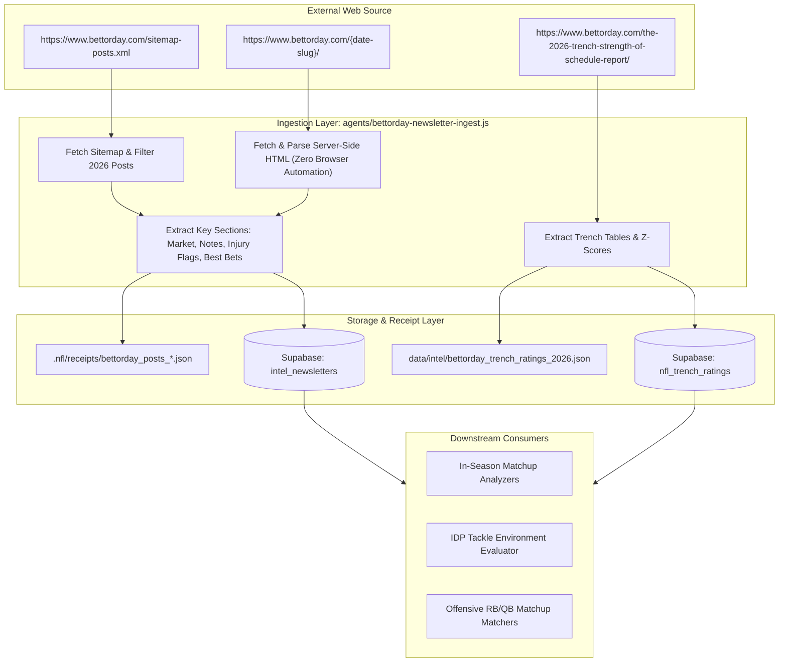

# 🏈 BettorDay Intelligence Pipeline: Technical Architecture & Specification

**Document Title**: NFL Dashboard BettorDay Holistic Intel Pipeline Specification  
**Date**: September 1, 2026  
**Audience**: Claude Engineering Team, Data Architects & System Evaluators  
**Status**: Proposed / Pre-Production Review  
**Corpus Root**: `e:/dev/projects/NFL_Dashboard`  

---

## 1. Executive Summary & Source Description

**Source Name**: BettorDay ("32 in 32" Daily Preseason Newsletters & In-Season Matchup/Trench Reports)  
**Host / Platform**: Ghost CMS (`https://www.bettorday.com`)  
**Publication Cadence**: Daily (Mon–Fri 6:00 AM ET) during preseason & regular season  
**Primary Authors**: Scott Seidenberg, Michael Fiddle, David Bearman, AJ Hoffman, Mackenzie Rivers  

### Core Value to the NFL Intel Ecosystem
While traditionally betting-focused, BettorDay provides distinct, high-value signals across multiple dimensions of the NFL Dashboard:

1. **The Trench Engine (O-Line vs. D-Line Composites):**
   - Quantified z-scores for all 32 teams across 4 fundamental composites: **Run Block (RB)**, **Pass Block (PB)**, **Run Defense (RD)**, and **Pass Rush (PR)**.
   - Cross-impacts offensive RB efficiency, QB sack/pressure risk, defensive DST ceilings, and IDP linebacker clean-pursuit lanes.
2. **Game Script & Regression Trajectories:**
   - Evaluates market win totals and pricing inefficiencies to identify positive/negative game-script funnels (e.g., Miami trailing script, Minnesota indoor passing environment, Rams/Patriots ceiling regression).
3. **Personnel & Scheme Intelligence:**
   - Granular injury severity context (e.g., Ashton Jeanty ankle sprain severity, DJ Moore leg injury), depth chart hierarchy confirmations (Luther Burden III starting WR2, Travis Etienne lead RB1 in NO), and play-caller philosophy transitions (Ben Johnson in CHI, Todd Monken in CLE).

---

## 2. Ingestion Architecture & Data Flow



---

## 3. Strict Boundary & Pipeline Ownership Rules

Per the engineering audit standards:
1. **Zero Overwrites to Live Board Files:** `agents/bettorday-newsletter-ingest.js` **never** writes to `docs/fantasy/2026_Rose_Bowl_*` or `public/2026_Rose_Bowl_*`. Those files are strictly owned by `agents/fantasy-rose-bowl-build.js`.
2. **Native HTTP Only:** Operates via standard Node `fetch` with browser headers. Zero heavy headless browser dependencies or interactive sessions required.
3. **Explicit Labeling:** All ingested text notes, projected totals, and z-score rankings are tagged `source='bettorday'` to maintain clear data lineage.

---

## 4. Target Database Schema (Supabase)

### Table 1: `intel_newsletters`
Captures individual newsletter editions, market quotes, and player mentions.

| Column | Type | Constraints / Description |
|---|---|---|
| `id` | `TEXT` | Primary key (`bettorday_{slug}`) |
| `source` | `TEXT` | Hardcoded `'bettorday'` |
| `title` | `TEXT` | Full article headline |
| `published_at` | `TIMESTAMPTZ` | Timestamp from Ghost post metadata |
| `url` | `TEXT` | Original post URL |
| `teams_mentioned` | `TEXT[]` | Array of three-letter NFL team codes (e.g. `['NYJ', 'LAR']`) |
| `summary` | `TEXT` | Clean extracted prose of the analysis |
| `raw_content` | `TEXT` | Sanitized full article text |
| `captured_at` | `TIMESTAMPTZ` | Ingestion timestamp (`now()`) |

### Table 2: `nfl_trench_ratings`
Captures the 4-composite line of scrimmage ratings per team.

| Column | Type | Constraints / Description |
|---|---|---|
| `team` | `TEXT` | Three-letter team abbreviation (PK component) |
| `season` | `INT` | e.g. `2026` (PK component) |
| `week` | `INT` | `0` for Preseason Baseline, `1..18` for In-Season (PK component) |
| `rank_overall` | `INT` | League rank 1–32 |
| `score_overall` | `NUMERIC(4,2)` | Composite z-score |
| `run_block_z` | `NUMERIC(4,2)` | Run blocking grade relative to league |
| `pass_block_z` | `NUMERIC(4,2)` | Pass blocking grade relative to league |
| `run_defense_z` | `NUMERIC(4,2)` | Run defense grade relative to league |
| `pass_rush_z` | `NUMERIC(4,2)` | Pass rush grade relative to league |
| `as_of_date` | `DATE` | Publication / captured date |

**Conflict Key:** `(team, season, week, as_of_date)`

---

## 5. Ingest Script CLI Specification

**File:** `agents/bettorday-newsletter-ingest.js`

```bash
# Ingest latest newsletters and trench report (dry run, saves to .nfl/receipts/ and data/intel/)
node agents/bettorday-newsletter-ingest.js --dry-run

# Full ingest writing to Supabase and local archives
node agents/bettorday-newsletter-ingest.js --season 2026

# Ingest specific post or limit history sweep
node agents/bettorday-newsletter-ingest.js --limit 10
```
