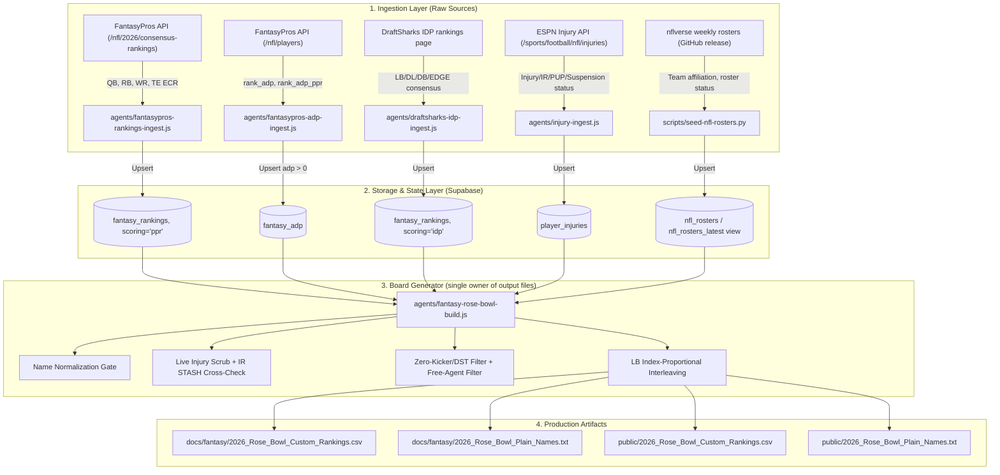

# 🏈 Fantasy Rankings Pipeline: Technical Architecture & Audit Specification

**Date**: September 1, 2026 (rewritten September 2, 2026 per engineering audit)
**Audience**: Claude Engineering Team & Lead Architects
**Scope**: End-to-End Ingestion, Normalization, Injury/IR Handling, LB Interleaving, and Custom Draft Room Output Generation

> **Revision Note (2026-09-02):** The original version of this document named `scratch/build-authentic-2026-rose-bowl.mjs` as the pipeline runner. That script (and five near-identical siblings) wrote directly to the production output files without Supabase access, was never committed, and was deleted during the audit after one of the siblings silently overwrote a curated live board. It also cited a Green Dot scheme guide document that doesn't exist in this repo and is read by no code. This version describes only what is actually built and running — `agents/fantasy-rose-bowl-build.js` — following the same audit-and-rewrite pattern already applied to `docs/specs/IDP_INTEL_PIPELINE_SPEC_2026-09-01.md`.

---

## 1. System Overview & Architecture

The NFL Dashboard Fantasy Rankings system reads live Supabase tables — market ADP, expert consensus rankings, DraftSharks IDP data, live injury reports, and nflverse roster data — and produces a single custom draft board plus a plain-name import file, with kickers/DST excluded and LBs interleaved into the mid rounds.



**`agents/fantasy-rose-bowl-build.js` is the sole writer of the four output files above.** No other script — scratch or otherwise — should write to `docs/fantasy/2026_Rose_Bowl_*` or `public/2026_Rose_Bowl_*`. Six scripts that violated this were removed on 2026-09-02.

---

## 2. Ingestion Pipeline & Data Sources

### A. FantasyPros Expert Consensus Rankings (ECR) — offense Tier tag + fallback fill
- **Script**: `agents/fantasypros-rankings-ingest.js`
- **Helper / Logic**: `agents/lib/fantasypros-rankings.js`
- **Endpoint**: `GET /nfl/{season}/consensus-rankings?position={POS}&type=draft&scoring={scoring}` — rejects `position=ALL` (confirmed live), so the script loops `QB`, `RB`, `WR`, `TE` sequentially at 1 req/sec.
- **Target Table**: `fantasy_rankings` (migration `046_fantasy_rankings.sql`), `scoring='ppr'`, `source='fantasypros'`.
  - Columns used downstream: `player`, `position`, `team`, `rank_ecr`, `tier`, `as_of_date`.
  - **`rank_ecr` is positional, not cross-position** — QB1, QB2... restarts at 1 for RB/WR/TE independently. The board generator uses this only for the per-player Tier tag and as a fallback fill for players missing live ADP; it is never used to sort offense positions against each other.

### B. Real Draft Room Market ADP — primary offense sort key
- **Script**: `agents/fantasypros-adp-ingest.js`
- **Helper / Logic**: `agents/lib/fantasypros-adp.js`
- **Endpoint**: `GET /nfl/players` (extracts `rank_adp`, `rank_adp_ppr`) — deliberately *not* `/consensus-rankings`, which only carries positional ECR.
- **Target Table**: `fantasy_adp` (migration `034_fantasy_adp.sql`), `scoring='ppr'`, `source='fantasypros'`.
- **Critical edge case handled**: FantasyPros returns `adp: 0` for undrafted/unranked players. The board generator's query filters `gt('adp', 0)` so these placeholders don't pollute the top of the board.
- This is real cross-position snake-draft market data, which is why it — not ECR — is the primary sort key for offensive players.

### C. DraftSharks IDP Rankings — the only live LB source
- **Script**: `agents/draftsharks-idp-ingest.js`
- **Endpoint**: `GET https://www.draftsharks.com/rankings/load-rows?offset=0&position=idp` (one HTTP request, native fetch + regex, no HTML parser dependency).
- **Target Table**: `fantasy_rankings`, `scoring='idp'`, `source='draftsharks'`.
- Returns rows for every defensive position (`LB`, `DL`, `DB`, `DE`, `DT`, `EDGE`, `EDR`, `ILB`, `OLB`, `CB`, `S`, `FS`, `SS`, `IDP`). The board generator filters this to `position === 'LB'` only — see `agents/fantasy-rose-bowl-build.js`, step 2.
- **This is the only IDP data source that actually feeds the board.** See `docs/specs/IDP_INTEL_PIPELINE_SPEC_2026-09-01.md` §5 for the sources (Every-Down IDP, IDP Guru, The IDP Show, PFF IDP, Footballguys) that were previously claimed as live but have no ingest agent in this codebase.

### D. Live Injury & Roster Status Ingestion
- **Script**: `agents/injury-ingest.js`
- **Endpoint**: `https://site.api.espn.com/apis/site/v2/sports/football/nfl/injuries`
- **Target Table**: `player_injuries` — columns `player_name`, `team_abbr`, `position`, `injury_status`, `injury_type`, `short_comment`, `long_comment`, `captured_at`.
- **Important limitation**: this feed reports injury designations only. It has no status value for "released/waived, off all rosters" — a player who is fully released can either vanish from the feed (misreadable as "no news") or keep showing a stale team/IR status. See §4 below for how the board generator compensates for this.

### E. nflverse Weekly Rosters — team-affiliation cross-check
- **Script**: `scripts/seed-nfl-rosters.py` (reads a CSV already downloaded by `scripts/fetch_nflverse_data.py --datasets rosters_weekly`)
- **Target Table**: `nfl_rosters` (migration `038_nfl_rosters.sql`), with a `nfl_rosters_latest` view (one row per player, most recent by `ingested_at`, fixed in migration `052` after a stale-tiebreak bug).
- This is the closest thing this repo has to a team-affiliation source, and is used to catch IR/PUP players who have since been released outright (see §4). It is a periodic snapshot, not a real-time transactions feed — a same-day release will not appear here immediately.

---

## 3. Data Cleansing & Normalization Engine

### A. Name Normalization (`nameKey`)
Uniform string sanitization, used identically across every ingest agent and the board generator:
```javascript
function nameKey(s) {
  return (s || '').toLowerCase()
    .replace(/[.'`\-]/g, '')
    .replace(/\b(jr|sr|ii|iii|iv|v)\b/g, '')
    .replace(/[^a-z0-9]+/g, ' ')
    .trim();
}
```

### B. Dedup-by-Collision-Key
The board generator dedupes on `(nameKey, position)`, not `nameKey` alone, so two different-position players sharing a stripped base name don't collide. It tracks occupancy with a `Map` (key → occupying player name) rather than a `Set`, so it can tell a real collision (two different players, same key) from an expected re-add (the same player seen twice across the ADP pass and the ECR fallback pass). Every real collision is logged for manual review, never silently dropped.

### C. Free-Agent Filter
Any offense or LB row where `team === 'FA'` is excluded — a standing rule, not a per-run option. This is separate from the injury-based exclusions below.

### D. Zero-Kicker / Zero-DST Policy
`K` and `DST`/`DEF` position rows are filtered out unconditionally before any other processing.

---

## 4. Injury Scrub & IR STASH (replaces the old static DO-NOT-DRAFT list)

The original version of this pipeline (and this spec) used a hardcoded, hand-maintained `DO_NOT_DRAFT` set of ~12 player names with inline comments guessing at their injury status. That list is gone. The current logic in `agents/fantasy-rose-bowl-build.js` (step 3) reads `player_injuries` live, at run time, and classifies every player by their **most recent** report (`captured_at` descending):

- **`Injured Reserve` / `PUP`** → excluded from the main board. Then:
  - If the player is in `MANUAL_FREE_AGENT_OVERRIDES` (a short, dated, commented set for cases confirmed by hand to be ahead of what the automated sources show — e.g. Trey Benson, released via injury settlement before either `player_injuries` or `nfl_rosters` had caught up) → dropped entirely, no stash.
  - Else if `nfl_rosters_latest.status === 'UFA'` → dropped entirely (confirmed free agent by the roster feed itself).
  - Else, if the position is one Rose Bowl actually rosters (`QB`/`RB`/`WR`/`TE`/`LB`) and the player has *some* ADP or ECR signal → offered as an **IR STASH candidate**, ranked by that signal, appended after the main board. Rose Bowl carries exactly one IR bench slot, so these players are demoted rather than deleted.
- **`Suspension`** → excluded entirely, no stash (not IR-slot eligible in a standard league).
- **`Out` / `Doubtful`** → kept on the main board, tagged informationally only (week-to-week status is not season-ending).

This is a live, self-updating scrub. No player names should ever be hardcoded into this logic outside of `MANUAL_FREE_AGENT_OVERRIDES`, and every entry there needs a dated comment explaining why it's ahead of the automated sources — it should be reviewed and pruned as those sources catch up.

---

## 5. LB Interleaving Engine

Default platforms (Yahoo, Sleeper, ESPN) push individual defensive players down to rank 350+. This pipeline interleaves the top LBs (default 40, from the DraftSharks pool above) into ranks 85–235:

- **Ranks 1–84**: Pure offense, ADP order.
- **Ranks 85–235**: LBs distributed using **index-proportional spacing** — `idpWindowStart + round(i × (windowSize-1) / (lbCount-1))` for the i-th LB — not a fixed ratio. A fixed 2:1 or 3:1 interleave was the original scratch scripts' bug: it exhausted the 40-LB pool by around rank 204 instead of spanning the full window to 235.
- **Ranks past 235 (up to `--total`, default 280)**: Remaining offense only.
- **After the main board**: IR STASH section (§4), ranked by ADP/ECR, appended last. Suppressible with `--no-ir-stash`.

Specific player-to-tier assignments are **not** hardcoded anywhere in this pipeline — the LB pool and its order come entirely from live DraftSharks data at run time (`fantasy_rankings`, `scoring='idp'`, filtered to `position='LB'`, sorted by `rank_ecr`).

---

## 6. Generated Artifacts & File Locations

| Output File | Path | Description |
|---|---|---|
| **Custom Rankings CSV** | `docs/fantasy/2026_Rose_Bowl_Custom_Rankings.csv` | Full table: Rank, Player, Position, Team, Tag (Tier / IDP LB / IR STASH / watch status) |
| **Yahoo/FantasyPros Prerankings Plain Text** | `docs/fantasy/2026_Rose_Bowl_Plain_Names.txt` | Single-column plain player names, one per rank, for direct import as a custom cheat sheet |
| **Public Mirror CSV** | `public/2026_Rose_Bowl_Custom_Rankings.csv` | Public/UI mirror of the draft board |
| **Public Mirror TXT** | `public/2026_Rose_Bowl_Plain_Names.txt` | Public/UI mirror of plain names |
| **Board Generator (sole writer of the four files above)** | `agents/fantasy-rose-bowl-build.js` | Reads live Supabase, applies §3/§4/§5, writes all four outputs |
| **Roster-status migration** | `supabase/migrations/052_nfl_rosters_latest_tiebreak.sql` | Fixes `nfl_rosters_latest`'s stale-row tiebreak (season/week ties now broken by `ingested_at desc`) |

---

## 7. Audit Checklist for Claude Team Review

1. **Single file owner**: Confirm `agents/fantasy-rose-bowl-build.js` is the only script in `agents/`, `scratch/`, or `scripts/` that writes to `docs/fantasy/2026_Rose_Bowl_*` or `public/2026_Rose_Bowl_*`.
2. **`adp > 0` gate**: Confirm the Supabase query against `fantasy_adp` excludes `adp = 0` (FantasyPros' undrafted placeholder).
3. **No hardcoded exclusion lists**: Confirm player exclusions come from live `player_injuries` classification (§4), not a static array — the only permitted exception is the small, dated `MANUAL_FREE_AGENT_OVERRIDES` set, and each entry there should have a plan to be removed once the automated sources catch up.
4. **LB position filter**: Confirm the IDP pool passed to the interleaver is filtered to `position === 'LB'` before sorting/ranking — DraftSharks' feed includes EDGE/DL/DB rows that must not leak into the LB slots.
5. **`nfl_rosters_latest` season check**: Confirm the build script warns if `nfl_rosters_latest` contains any season other than the current one (stale-season regression guard).
6. **IR STASH ordering**: Confirm IR STASH candidates are ranked by ADP/ECR signal (best first), not arbitrarily, and that unranked IR/PUP players (no ADP or ECR at all) are excluded from the stash rather than padding it with practice-squad names.
