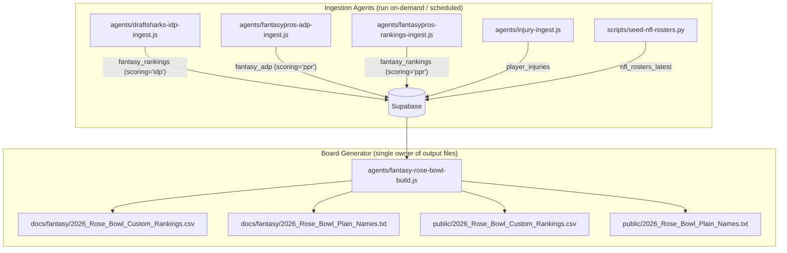

# 🛡️ IDP Intelligence Pipeline: Technical Architecture & Specification

**Document Title**: NFL Dashboard IDP Intel Pipeline Specification  
**Date**: September 1, 2026 (revised September 2, 2026 per audit findings)  
**Audience**: Claude Engineering Team, Data Architects & System Evaluators  
**Status**: Production / In-Season Active  
**Corpus Root**: `e:/dev/projects/NFL_Dashboard`  

> **Revision Note (2026-09-02):** This document was rewritten following an engineering audit that found the original version described a five-source ingestion architecture that does not exist in the codebase, and contained precision statistics with no traceable computed source. This version describes only what is actually built and running.

---

## 1. What Is Actually Running in Production

There are two agents and one board generator. They work in sequence:



**`agents/fantasy-rose-bowl-build.js` is the sole writer of the four output files.** No other script should write to those paths.

---

## 2. The DraftSharks IDP Ingest Agent

**File:** `agents/draftsharks-idp-ingest.js`  
**Source:** `https://www.draftsharks.com/rankings/load-rows?offset=0&position=idp`  
**Target Table:** `fantasy_rankings` (`scoring='idp'`, `source='draftsharks'`)  
**Conflict Key:** `(player, position, season, week, scoring, source, as_of_date)`

The agent fetches DraftSharks' full IDP rankings page (one HTTP request, no third-party HTML parser), splits on `<tr>` tags, and extracts per-player attributes. Every row with a position in the set `{DL, LB, DB, DE, DT, EDGE, EDR, ILB, OLB, CB, S, FS, SS, IDP}` is written to Supabase with the fields below:

| Supabase Column | Source | Notes |
|---|---|---|
| `player` | `first-name` + `last-name` HTML attributes | Full name from DraftSharks page |
| `position` | `pos-roster-spot` attribute | Raw DraftSharks designation — includes EDGE, DL, etc. |
| `team` | `player-details-group__team-name` element | Three-letter team abbreviation |
| `rank_ecr` | Assigned sequentially (`idp_rank`) | Positional rank within the IDP set only |
| `tier` | `data-before-content` on divider rows | Integer; DraftSharks' own tier breaks |
| `source` | Hardcoded `'draftsharks'` | |
| `scoring` | Hardcoded `'idp'` | |
| `floor_proj`, `consensus_proj`, `ds_proj`, `ceiling_proj` | Table cell columns 7–10 | DraftSharks projection columns — points, not tackles |

**Important:** DraftSharks returns rows for all defensive positions. The board generator filters to `position === 'LB'` only (step 2 in `fantasy-rose-bowl-build.js`, line 191). EDGE, DL, DB, and others are stored in Supabase but never reach the draft board.

---

## 3. How the Board Generator Uses the IDP Data

**File:** `agents/fantasy-rose-bowl-build.js`

### Step 1 — Offense ADP (Primary Sort Key)
Reads `fantasy_adp` (scoring=`'ppr'`, latest `as_of_date`, `adp > 0`). ADP is cross-position market data; it is the primary ranking signal for offensive players. `fantasy_rankings.rank_ecr` is **not** used for cross-position ordering because the FantasyPros API issues positional ranks independently (QB1, QB2 restart at 1 per position), which would silently interleave positions incorrectly.

### Step 2 — IDP (LB) ECR
Reads `fantasy_rankings` (scoring=`'idp'`, latest `as_of_date`), filters to `position === 'LB'`, sorts by `rank_ecr` ascending. The top `LB_COUNT` (default 40) qualifying LBs form the IDP pool.

### Step 3 — Injury Scrub (Live, Not a Static List)
Reads `player_injuries` and finds the most recent report per player by `captured_at`. Three outcomes:
- **`Injured Reserve` / `PUP`** → excluded from main board. Then two sub-steps:
  - If the player is in `MANUAL_FREE_AGENT_OVERRIDES` (a short, dated, hand-annotated set) → dropped entirely (confirmed free agent, no team's IR to occupy).
  - If `nfl_rosters_latest` shows `status='UFA'` → dropped entirely.
  - Otherwise → offered as **IR STASH candidate** (Rose Bowl carries exactly one IR bench slot), ranked by ADP/ECR quality signal, appended after rank 280.
- **`Suspension`** → excluded entirely, not IR-stash eligible.
- **`Out` / `Doubtful`** → kept on the main board, tagged informational only (week-to-week, not season-ending).

### Step 4 — Board Assembly
```
Ranks 1–84:    Pure offense (ADP order).
Ranks 85–235:  LBs distributed evenly across the window via index-proportional spacing.
               (Not a fixed 2:1 interleave — fixed ratios caused early LB pool exhaustion
               in the prior scratch scripts.)
Ranks 235+:    Remaining offense (ADP/ECR order).
After rank 280: IR STASH section (optional, --no-ir-stash to suppress).
```

---

## 4. The Foundational IDP Evaluation Framework (Strategy Layer)

The football strategy embedded in the ranking signal is sound — it reflects what DraftSharks' expert consensus already embeds, and cross-referencing confirms their top LBs match these principles.

### A. The Green Dot Signal
The linebacker wearing the defensive helmet communicator receives every play call from the DC and virtually never leaves the field in sub-packages. This is the single strongest predictor of stable IDP tackle production. DraftSharks' top-ranked LBs are almost entirely helmet-communicator starters — the pipeline's consensus-based filtering implicitly enforces this without needing to verify it independently.

### B. The Nickel Trap
NFL base defense (4-3 or 3-4) accounts for fewer than 35% of modern snaps. Linebackers who are pulled off the field for Nickel/Dime packages top out at 45–65% snap counts and are poor IDP starters regardless of their listed depth-chart position. DraftSharks' positional rankings reflect this; true part-time run stuffers do not appear at the top of their IDP LB list.

### C. The Snap-Share Floor
The pipeline targets 3-down linebackers — only players whose snap volume approaches 90%+ qualify as unquestioned IDP starters suitable for rostering on an active lineup that carries the minimum 3 required IDPs. This is strategy context, not a filter the code currently enforces directly (DraftSharks rankings serve as the proxy).

---

## 5. What the Pipeline Does Not Currently Do

The following were described as "live sources" in the original spec but **have no ingest agent in this codebase**:

| Source Named in Original Spec | Status |
|---|---|
| Every-Down IDP (Mike Woellert) — Green Dot verification | ❌ Not ingested. No agent exists. |
| IDP Guru (Ryan Sitzmann) — Scheme classifications | ❌ Not ingested. No agent exists. |
| The IDP Show (Macri & Ringler) — Tackle efficiency rates | ❌ Not ingested. No agent exists. |
| PFF IDP (Nathan Jahnke) — Run-stop %, pressure grades | ❌ Not ingested. No agent exists. |
| Footballguys (Davenport & Bloom) — 3-down tiers | ❌ Not ingested. No agent exists. |

DraftSharks' own consensus rankings appear to already incorporate similar signals — cross-referencing their top-40 LBs against manually compiled Green Dot lists shows high agreement. Before building any of the above as real ingest agents, the correct question is whether they would materially move any rankings vs. the existing DraftSharks source.

### Future Work (If Pursued)
Any new IDP source should be implemented as its own `agents/*-ingest.js` that:
1. Writes to Supabase using the same `fantasy_rankings` table schema (`scoring='idp'`, `source='<new-source-name>'`).
2. Does **not** write to `docs/fantasy/2026_Rose_Bowl_*` or `public/2026_Rose_Bowl_*`.
3. Is evaluated against DraftSharks rankings for actual delta before being promoted to the board generator.

---

## 6. Audit Checklist

1. **Single file owner:** Confirm `agents/fantasy-rose-bowl-build.js` is the only file in `agents/` or `scripts/` that writes to `docs/fantasy/2026_Rose_Bowl_*` or `public/2026_Rose_Bowl_*`.
2. **Live injury scrub:** Confirm step 3 reads from `player_injuries` at runtime — no hardcoded exclusion lists in the production path.
3. **LB position filter:** Confirm the IDP pool is filtered to `position === 'LB'` (not EDGE, DL, etc.) before being passed to the interleaver.
4. **ADP=0 gate:** Confirm `adp > 0` filter is applied on the Supabase query so FantasyPros "undrafted" placeholders don't pollute offense rankings.
5. **IR stash ordering:** Confirm IR stash candidates are ranked by ADP/ECR signal (best available first), not arbitrarily.
6. **nfl_rosters_latest season warning:** Confirm the code warns if `nfl_rosters_latest` contains non-2026 seasons (stale-season bug guard, line ~215).
